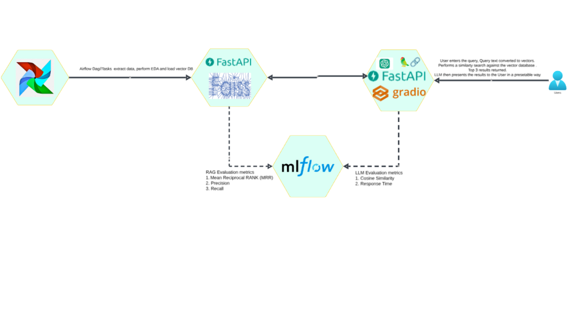
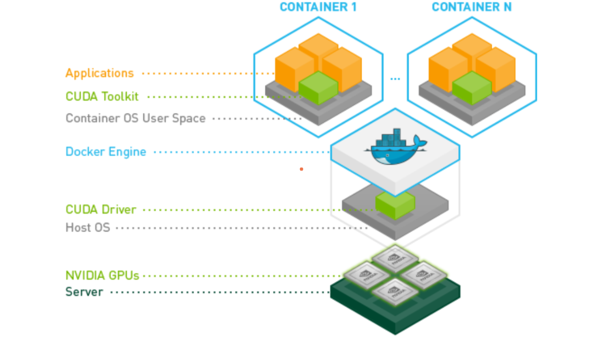
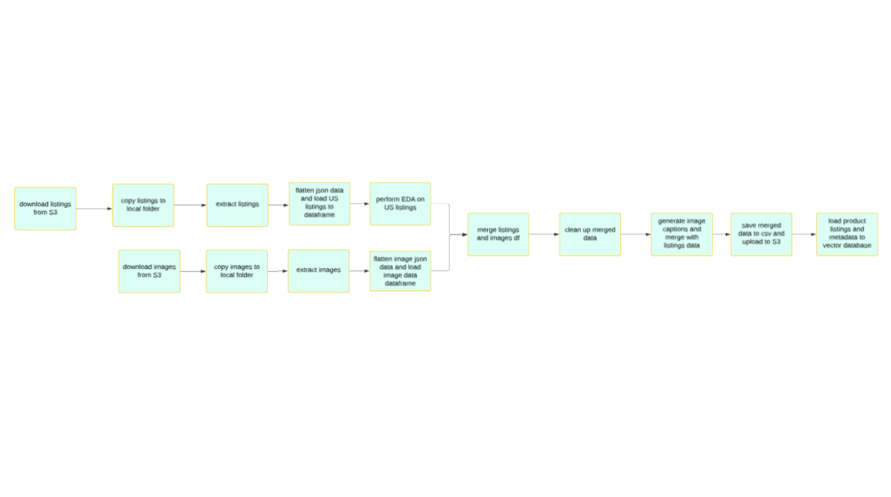

# Shoptalk 
## 📖 Table of Contents

1. [Project Overview](#1-project-overview)  
2. [Tech Stack](#2-tech-stack)
3. [System Components](#3-system-components)  
4. [Data Flow](#4-data-flow)  
5. [Deployment Setup](#5-deployment-setup)  
6. [Model Evaluation & Monitoring](#6-model-evaluation--monitoring)  
7. [Dataset](#7-dataset)  
8. [Challenges & Learnings](#8-challenges--learnings)  
9. [Future Improvements](#9-future-improvements) 
10. [Repository Structure](#10-repository-structure)
11. [GoogleColab Notebooks](#11-google-colab-notebooks)
12. [Team Contacts](#12-team-contacts)


## 1. Project Overview 📌

**Objective**:  
The objective of this project is to develop an intelligent AI-powered Shopping Assistant that enables users to interact with an e-commerce platform using natural language queries. Unlike traditional keyword-based search engines, this assistant will understand complex and nuanced queries, retrieve relevant product information using Retrieval-Augmented Generation (RAG), and provide personalized and human-like responses through Natural Language Generation (NLG). The system aims to enhance product discoverability, align search results with user intent, and deliver a superior user experience that is fast, accurate, and conversational.

**Key Features**:

### 1. 🧠 Natural Language Query Understanding
- Supports complex queries like: _“Show me red dresses under $100 for evening wear”_
- Handles synonyms, contextual variations, and user intent

### 2. 🔍 Semantic Product Retrieval (RAG)
- Uses vector-based retrieval + LLMs for highly relevant results
- Searches across product metadata, bullet points, descriptions, etc.

### 3. 🗣️ Natural Language Generation (NLG)
- Converts search results into friendly, coherent responses
- Generates summaries and personalized recommendations

### 4. 🖼️ Multimodal Support (Optional/Future Scope)
- Uses image data and captioning to enhance search accuracy
- Responds to queries like _“something like the blue sneakers I saw yesterday”_

### 5. ⚡ Real-Time Responsiveness
- Fast response time for interactive user experience
- Optimized pipeline for low-latency and scalable performance

### 6. 🧭 User Experience Optimization
- Clear, concise, and helpful recommendations
- Reduces search friction and improves satisfaction
  
## 💼 Business Use Case

Traditional keyword-based search limits user experience and fails to meet modern expectations in e-commerce. This Conversational Shopping Assistant provides:

- ✅ **Higher Conversion Rates**  
  By improving search relevance and matching user intent

- ✅ **Improved Net Promoter Score (NPS)**  
  Natural, intuitive interactions increase customer satisfaction

- ✅ **Lower Bounce Rates**  
  Keeps users engaged with dynamic and personalized responses

## 2. Tech Stack

| Layer        | Technology                        |
|--------------|-----------------------------------|
| Frontend     | Gradio                            |
| Backend      | Airflow / FastAPI / RAG           |
| Libraries    | PyTorch / HuggingFace Transformers|
| Database     | PostgreSQL / Redis / MongoDB      |
| Vector DB    | Chroma / Milvus / FAISS           |
| Deployment   | Docker, EC2                       |
| Evaluation   | MLflow                            |
| LLM & Prompting |	OpenAI GPT, LangChain          | 

## 3. System Components

> 

## 4. Data Flow

### 📥 User Interaction
- The user inputs a query through the frontend interface.

### 🌐 Frontend Logic
- The frontend captures the input and sends it as an API request to the backend service.

### 🧩 Backend Handling
- The backend receives the request and routes it to the appropriate microservice based on the operation type (e.g., metadata lookup, inference, etc.).

### 🤖 ML Inference
- The inference service performs the following:
  - **Preprocessing** of input data
  - **Embedding Generation** using pre-trained models
  - **Semantic Search** via **Vector DB**
  - **Natural Language Generation** (if applicable) to generate human-readable responses

### 📤 Response
- The result is returned as a structured JSON response.
- The frontend parses the response and displays the output to the user in a friendly format.

## 5. Deployment Details

### 🖥️ Infrastructure

- **EC2 Setup**:  
  - Instance Type: `g4dn.2xlarge`   
  - Security Groups: microservices configured to default
  - IAM roles: EC2 is given full access to S3 bucket 
  - AMI: amazon/Deep Learning OSS Nvidia Driver AMI GPU PyTorch 2.6.0 (Ubuntu 22.04) 20250223
- > 

---

### 🐳 Docker & Microservices

- **Dockerization**:
    
  - Docker containers:
    -  Airflow Containers- ()
    -  RAG UI Service
    -  Vector DB Service
    -  MLFlow

- **Service Orchestration**:  
    - `docker-compose.yml` to manage multiple containers  
  
---

## 6. Model Evaluation

### 📈 Metrics Tracked using MLFlow
- **Accuracy**
- **Precision**
- **Recall**
- **F1-score**

### 7. Dataset
- **Details about Dataset**:  
  - Amazon Berkeley Objects (ABO) Dataset. https://amazon-berkeley-objects.s3.amazonaws.com/index.html 
  - Size: [collection of 147,702 product listings with images]
  - Used two main folders- 
    - Product description and metadata - `archives/abo-listings.tar`
    - Catalog imagery, in original and smaller (256px) resolution - `archives/abo-images-small.tar`

## 8. Challenges & Learnings

- Setting up Ec2 with the code thats working on Google colab
- Microservice integration and inter-service communication
- Dockerizing large ML models and optimizing image sizes
- Because we are computing with gpu instead of cpu, our credits was continuosly exhausting if we use entire dataset, so we ran entire dataset using google colab notebook setting it to T4 and on ec2 we had to restrict for 2000 images to continue our project.
- Integrating MLFlow for evaluating RAG and with LLM 

---

## 9. Future Improvements

- Handling responses if there are missing images for the given query
- Adding a feedback loop for continuous model improvement
- Enhancing monitoring to include concept drift and data quality alerts
- Handling Empty Image situations

---

## 10. Repository Structure

```bash
shoptalk-proj
├── airflow-dag/              # List of airflow tasks to extract data from jar files and save onto S3
├── rag-ui-service/           # frontend UI to backend RAG communication
├── vector_db_service/        # Searching embeddings using FAISS and Cupy(for GPU)
├── docker-compose.yml        # Compose setup
├── DockerFile/               # configuration for main container
├── docker-compose.yaml/      # configuration file to share other microservices which are inturn running on separte containers
├── README.md                 # This file
└── *.sh                      # created shell cripts to cleanup, settingup environment, pull secerets and keys and start docker container
```
- ## 🧩 **airflow-dag**: ShopTalk Ingestion Pipeline

This DAG orchestrates the end-to-end ingestion and processing of product listings and image metadata using **Apache Airflow**. It automates tasks such as downloading data, extracting and flattening JSON files, performing EDA, generating image captions, and triggering the FAISS vector database loader.

The goal is to build a **cleaned, flattened, and captioned product dataset** that can later be indexed and searched semantically using FAISS and LLMs.

---

### 🔄 Workflow Overview

| Step | Task Name | Description |
|------|-----------|-------------|
| 1️⃣   | `copy_listings_to_local_folder_from_s3` | Copy product listing tar from S3. |
| 2️⃣   | `copy_listings_tar_file` → `extract_tar_file` | Move and extract listing metadata. |
| 3️⃣   | `flatten_all_json_and_save_US_data_as_csv` | Flatten listing JSONs to CSV (US only). |
| 4️⃣   | `load_us_data_and_perform_eda` → `perform_eda_on_us_listings_data` | Load and analyze listing data. |
| 5️⃣   | `copy_images_to_local_folder_from_s3` → `copy_to_rawimage_folder` | Copy image tar from S3 and move to raw folder. |
| 6️⃣   | `extract_tar_file_images` → `flatten_to_csv_images` | Extract and flatten image metadata. |
| 7️⃣   | `merge_listings_image_df_task` → `merged_data_clean_up_task` | Merge listings and images, clean up missing data. |
| 8️⃣   | `generate_image_captions_task` → `upload_captions_to_s3_task` | Generate captions and upload to S3. |
| 9️⃣   | `check_if_data_file_arrived_task` → `load_faiss_vector_db_task` | Validate S3 upload, then trigger FAISS index load. |

---
- > 

## 🛍️ **rag-ui-service**: Conversational Shopping Assistant

This module powers the frontend and backend logic for **ShopTalk**, a personalized shopping assistant that integrates Large Language Models (LLMs), vector search, and interactive UI via Gradio.

---

### 🎯 Key Features

- Accepts user queries via a conversational UI.
- Performs **semantic vector search** using FAISS to retrieve top product matches.
- Uses **OpenAI's GPT-3.5** via LangChain to:
  - Rephrase descriptions.
  - Generate personalized sales pitches.
- Renders results (images + descriptions) using **Gradio**.
- Logs and evaluates responses using **MLflow** and NLP metrics.

---

### 🔄 Workflow

| Step | Description |
|------|-------------|
| **1. User Input** | Accepts shopping query via Gradio UI. |
| **2. Vector Search** | Sends prompt to FastAPI endpoint using FAISS for top-k image results. |
| **3. LLM Generation** | Generates natural responses and product pitches using OpenAI GPT-3.5. |
| **4. Display Results** | Shows product images, details, and a custom LLM-generated sales pitch. |
| **5. Evaluation & Logging** | Evaluates generated text using ROUGE, BLEU, Cosine similarity and logs metrics to MLflow. |

---

## ⚡ **vector_db_service**: FAISS Vector Search & Evaluation Service (Backend)

This Flask application powers the backend vector database component for ShopTalk. It enables GPU-accelerated FAISS search over product embeddings and supports multiple endpoints for indexing, searching, and evaluation using MLflow.

### 🎯 Purpose

Traditional keyword-based search fails to understand user intent and product context. This service solves that by:
- Converting queries and product metadata into **dense vector embeddings**.
- Using **FAISS** to perform **Approximate Nearest Neighbor (ANN)** search for fast top-k retrieval.
- Evaluating how good the retrieved results are using NLP metrics.
- Logging every experiment for comparison and improvement.

---

### 🎯 Key Functionalities

| Endpoint                    | Method | Description |
|-----------------------------|--------|-------------|
| `/`                         | GET    | Health check for FAISS service |
| `/add`                      | GET/POST | Placeholder for vector addition |
| `/string-reverse`          | POST   | Utility endpoint to reverse a string (test endpoint) |
| `/search`                  | POST   | Search over FAISS by query embedding and return top K image paths |
| `/search_v2`               | POST   | Vector search using GPU with metadata return |
| `/faiss-search`            | POST   | Search + evaluation (Recall@K, Precision@K, MRR) + MLflow tracking |
| `/load_data_file_from_s3`  | POST   | Loads CSV from S3, embeds text, builds FAISS index, uploads results |

---

## 11. GoogleColab Notebooks

  - [ShopTalk-all-listings-initial-analysis](https://colab.research.google.com/drive/1EqinYeJ5PSk4c9XREXfJJmKRZFNKbgi2) 
  - [ShopTalk-Image-Captioning](https://colab.research.google.com/drive/1i1AyOedvdQ1_jSSNa_CCKRFVKvOs7alq)
  - [Embeddings-to-Chroma-VectorDB](https://colab.research.google.com/drive/1r0b2XXwO7GFOEHdyXlp46K3Hyj0Cap8y)
  - Top-K-Records-with-salespitch-and-images
    - [Shopping-umbrella](https://colab.research.google.com/drive/1QuwmUwaRLftS5nrCeCgXG_cLsDGCAfyD)
    - [Shopping-birthday-gift-7yr-old](https://colab.research.google.com/drive/16IwrNV_8Et-3MRXZUV7yWHbcFbRYlXEv)
    - [Shopping-womens-watch](https://colab.research.google.com/drive/1biVZcZLWp0og-bQACoujImqGywY58E6d)
    - [Shopping-Shoe](https://colab.research.google.com/drive/15VP6ChsL8_qfKL1P7HlTXYK2cSKMf4x4)
    - [Shopping-soft-toy-2yr-old](https://colab.research.google.com/drive/1YfrrPCBBTLFCyC9T-leOVtL8JNTJdQR9)
    - [Shopping-expensive-mens-jacket](https://colab.research.google.com/drive/1CHxVEfEMG4ClBNVVXhb06IJG1LoYVZXl)
  - Exploring FAISS VectorDB options
    - [FAISS-IVF-PQ-Indexing](https://colab.research.google.com/drive/1XpT1FSwoOO5Pk8fXqsOzU_oXkjr3Jv9j)
    - [FAISS-HNSW-Indexing](https://colab.research.google.com/drive/1ojgbYRg7V3_WUi_vBazcLXgcCUZElSBp)
    - [FAISS-FlatL2-Indexing](https://colab.research.google.com/drive/1qVPMOMgZU6MYbSdlo4nkp15yUGlKzoSL)
 
## 12. Team Contacts

- **Authors**: VidyaSagar Vasamsetty, Vijaya Lakshmi Ijjada, Sumit Kumar Singh, Srinivas Nagamantha  
- **Email**: vasamsetty@gmail.com,onlinevijaya30@gmail.com,kumarsumitsingh@gmail.com,nagamantha11@gmail.com 
- **GitHub**: https://github.com/sagarsGitArena/shop-talk


